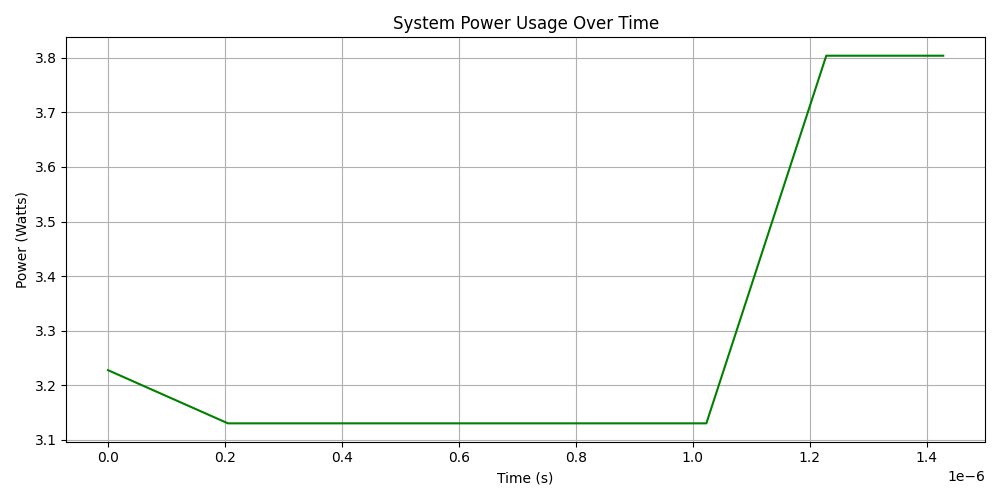
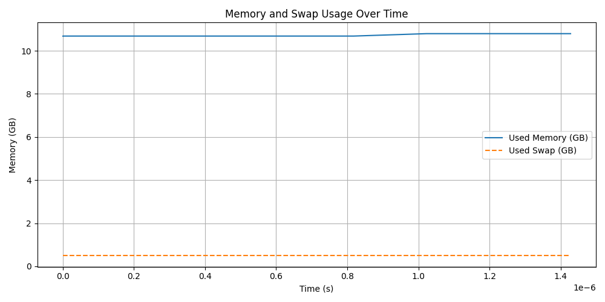
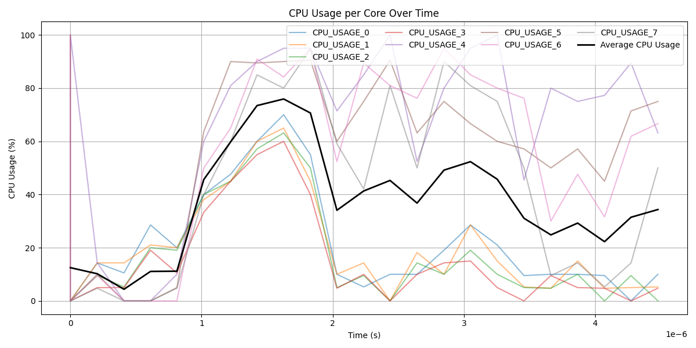

# Measuring the Energy Consumption of Java/Kotlin Builds: Gradle vs. Maven vs. Bazel

Author: Jakub Jarosław Patałuch (Student number: 5514274)

Repository: [GitHub](https://github.com/kubapat/SSE_Project_1)
## Introduction
Build tools like Gradle, Maven, and Bazel are crucial for modern Java and Kotlin development. They manage everything from dependency resolution to compilation and packaging. But beyond speed and reliability, another metric is increasingly relevant: energy consumption.

In this post, I explore and compare the energy profiles of Gradle, Maven, and Bazel when building the same Java/Kotlin project. Using EnergiBridge, I recorded system metrics to understand how these tools impact CPU usage, memory, and overall power consumption.

## Setup

### Tools Used
- **EnergiBridge**: A tool for measuring energy consumption and system metrics.
- **Gradle (ver. 8.10)**: A popular build tool for Java and Kotlin.
- **Maven (ver. 3.11.0)**: Another widely used build tool for Java.
- **Bazel (ver. 8.2.1)**: A build tool that emphasizes speed and correctness.
- **Python**: For data analysis and visualization.

### Environment
- **Operating System**: MacOS 15.4
- **Java Version**: OpenJDK 21
- **Hardware**: MacBook Air with M1 chip, 16GB RAM, 8-core CPU
- **Project**: A simple Java project with one main class outputting "Hello World"

### Project Structure
```plaintext
root-project-dir/
├── build.gradle.kts
├── settings.gradle.kts
├── pom.xml
├── WORKSPACE
├── BUILD.bazel
├── src/
│   └── main/
│       └── java/
│           └── org/
│               └── example/
│                   └── Main.java
```

### Experiment Procedure
As mentioned, project is a simple Java project with one main class outputting "Hello World". For sake of simplicity, I mentioned only one project structure containing all three build tools, but in reality, I created three separate projects for each build tool. The project structure is the same for all three build tools. The only real difference are respective build files. I set up all projects with help of IntelliJ. Once that was done, I built all projects and then run ``clean`` command for each build tool. Then I started the experiments with following commands:
```bash
# Gradle
./energibridge -o gradle.csv --summary -- /Users/jakubpataluch/IdeaProjects/gradle-java-sample/gradlew -p /Users/jakubpataluch/IdeaProjects/gradle-java-sample/ build

# Maven
./energibridge -o maven.csv --summary -- /Users/jakubpataluch/Library/Java/JavaVirtualMachines/openjdk-21.0.2/Contents/Home/bin/java -Dmaven.multiModuleProjectDirectory=/Users/jakubpataluch/IdeaProjects/maven-java-sample -Djansi.passthrough=true -Dmaven.home="/Users/jakubpataluch/Applications/IntelliJ IDEA Ultimate.app/Contents/plugins/maven/lib/maven3" -Dclassworlds.conf="/Users/jakubpataluch/Applications/IntelliJ IDEA Ultimate.app/Contents/plugins/maven/lib/maven3/bin/m2.conf" -Dmaven.ext.class.path="/Users/jakubpataluch/Applications/IntelliJ IDEA Ultimate.app/Contents/plugins/maven/lib/maven-event-listener.jar" -javaagent:"/Users/jakubpataluch/Applications/IntelliJ IDEA Ultimate.app/Contents/lib/idea_rt.jar"=61979 -Dfile.encoding=UTF-8 -Dsun.stdout.encoding=UTF-8 -Dsun.stderr.encoding=UTF-8 -classpath "/Users/jakubpataluch/Applications/IntelliJ IDEA Ultimate.app/Contents/plugins/maven/lib/maven3/boot/plexus-classworlds.license":"/Users/jakubpataluch/Applications/IntelliJ IDEA Ultimate.app/Contents/plugins/maven/lib/maven3/boot/plexus-classworlds-2.8.0.jar" org.codehaus.classworlds.Launcher -Didea.version=2024.3.5 -f/Users/jakubpataluch/IdeaProjects/maven-java-sample/pom.xml package

# Bazel
./energibridge -o bazel.csv --summary -- /Users/jakubpataluch/Library/Caches/bazelbsp/bazelisk build //:hello
```

### Data Analysis
After running the experiments, I used Python script to visualize collected data and to produce 4 plots for each build tool:

- CPU Usage per core
- System Power Over Time
- Used Memory Over Time
- Histogram of Power Usage

Then I used the same script to produce 4 less-detailed plots comparing all three build tools.
EnergiBridge also produced summative result of consumption in Joules, which I used to compare the overall energy consumption of each build tool.


## Results
### Gradle
```
Energy consumption in joules: 4.618369125366211 for 1.441175 sec of execution.

```





### Maven
```
Energy consumption in joules: 7.585421275377272 for 2.2641368 sec of execution.
```


### Bazel
```
Energy consumption in joules: 25.904505553722384 for 4.4904547 sec of execution.
```



### Comparison of All Three Build Tools


## Key observations
1. Energy density differs by much – if we normalise by execution time, Gradle averages approx. 3.2 J/s, Maven around 3.3J/s, and Bazel around 5.8J/s. Bazel therefore not only runs longer but also draws considerably more power each second, explaining its five‑fold total energy usage.
2. Gradle fires a short, mostly parallel burst that finishes just as thermal throttling would ordinarily start.
3. Maven shows two phases – an initial dependency‑resolution spike, a dip, then a second compile spike, which explains slightly wider power‑histogram footprint.
4. Bazel keeps all eight M1 cores busy for nearly the whole 4.5s window, with minimal idle
5. All three builds stay under 1GiB resident, with Bazel peaking approx. 120MiB above Gradle/Maven. The small deltas suggest memory is not really a factor for such a simple project.

## Conclusions
1. Build system architecture matters. Gradle’s daemon and incremental compiler warm quickly, giving it the best energy‑to‑time ratio. Maven’s sequential lifecycle adds approx. 1s but keeps power draw similar. Bazel’s sand‑boxed, rule‑based engine launches more processes and does more dependency scanning, increasing both runtime and wattage.
2. Energy intensity scales with concurrency, not just duration. Bazel’s per‑second draw is approx. 75% higher than Gradle/Maven even before we multiply by its longer runtime.
3. For small Java/Kotlin projects, Gradle is the most green build tool, where Maven is some middle ground (especially due to low complexity). Bazel’s gains (hermetic builds, remote caching, language polyglotism) only start to shine in terms of greenness on very large codebases where cache hits amortise its startup cost.

## Threats to Validity
1. The experiment was conducted on a single machine, which may not be representative of all environments.
2. “Hello World” project is not representative of real‑world projects, which may have different dependencies and build configurations.
3. Author expertise may bias build‑file quality (e.g. Gradle’s Kotlin DSL is more verbose than Groovy, but the author is more familiar with it or badly optimised Bazel WORKSPACE due to lack of familiarity with this particular build tool).
4. Only one run of each build was performed, which may not account for variability in system performance.
